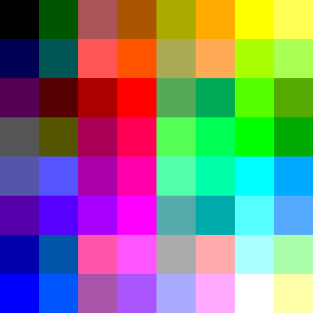

# hilbert.scala
2-D and 3-D Hilbert Curves and color-pickers, for the JVM and Javascript

[Demo](https://storage.googleapis.com/hilbert/colors/index.html)



Sample images in [web/imgs](web/imgs) generated from command-line via:

```
sbt cli/run
```

The gif above iterates through three "resolutions" of curve: 2^6, 2^12, and 2^18 colors, because powers of 2^6 == 64 can be the volume of an RGB cube with power-of-2 edge length as well as the area of a square with power-of-2 side length, meaning a 3-D (resp. 2-D) Hilbert curve can traverse each and map between them.

Specifically, the eligible sizes are:
- 8x8 ⟺ 4x4x4 (each color axis gets 4 values: 0, 0x55, 0xaa, and 0xff)
- 64x64 ⟺ 16x16x16 (each axis gets 16 values: 0x00, 0x11, …, 0xff)
- 512x512 ⟺ 64x64x64 (each axis gets 64 values: `{255i/63; i ∈ [0,63]}`)
- there's also a 4096x4096 ⟺ 256x256x256 that covers the full 3-byte RGB cube, but I haven't added those to this repo yet
  - they're visually basically indistinguishable from the 512x512 versions, and are a bit large / expensive to compute / unwieldy to store in `git`
  - I did make them in a previous pure-JS version of this library: [ryan-williams/hilbert](https://github.com/ryan-williams/hilbert)
