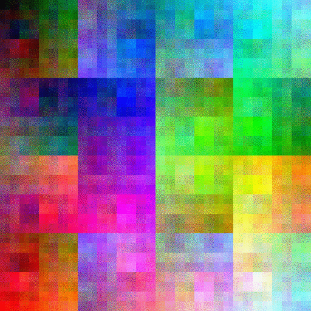

# hilbert.scala
2-D and 3-D Hilbert Curves and color-pickers, for the JVM and Javascript

[Demo](https://storage.googleapis.com/hilbert/colors/index.html)





Sample images in [web/imgs](web/imgs) generated from command-line via:

```
sbt cli/run
```

GIFs made via ImageMagick:
```
for size in 8 64 512; do
  convert -delay 60 -loop 0 web/imgs/hilbert-$size-512-* web/imgs/hilbert-$size-512.gif
done
```

They're all 512x512, but the three available side dimensions (8, 64, 512) represent sizes that contain a total number of colors that is a cube of a power of 2, meaning a 3-D Hilbert curve can traverse an RGB cube and also be mapped into a power-of-2-sided square with a 2-D Hilbert curve, i.e.:
- 8x8 ⟺ 4x4x4 (each color axis gets 4 values: 0, 0x55, 0xaa, and 0xff)
- 64x64 ⟺ 16x16x16 (each axis gets 16 values: 0x00, 0x11, …, 0xff)
- 512x512 ⟺ 64x64x64 (each axis gets 64 values: `{255i/63; i ∈ [0,63]}`)
- there's also a 4096x4096 ⟺ 256x256x256 that covers the full 3-byte RGB cube, but I haven't added those to the mix yet
  - they're visually basically indistinguishable from the 512x512 versions, and are a bit large / expensive to compute
  - I did make them in a previous pure-JS version of this library: [ryan-williams/hilbert](https://github.com/ryan-williams/hilbert)
